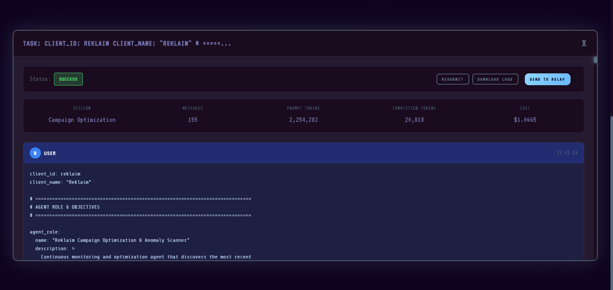
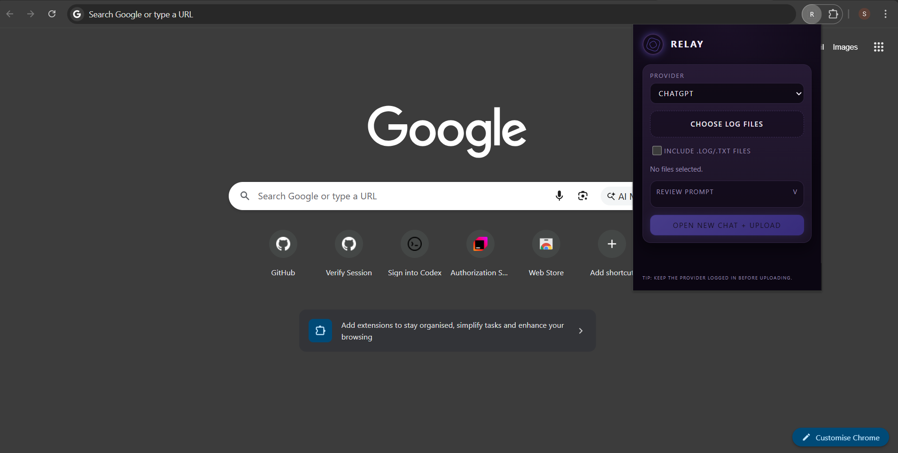

# Relay

Relay is a lightweight Chromium extension for uploading local logs into ChatGPT, Gemini, or Claude for analysis.

## Why Relay
- Fast path from local logs to LLM analysis.
- Works across multiple providers with one workflow.
- Keeps uploads local to your browser session.

## Screenshots

## Repository layout
- `packages/relay-log-uploader` - The MV3 extension source
- `docs/images` - README screenshots

## Quick start
1. Open `chrome://extensions`.
2. Enable **Developer mode**.
3. Click **Load unpacked** and select `packages/relay-log-uploader`.
4. Pick your provider, choose log files, and click **Open new chat + upload**.

## Notes
- The extension looks for a file input in the provider UI and injects files into it.
- If providers change their upload UI, the content script may need updates.
